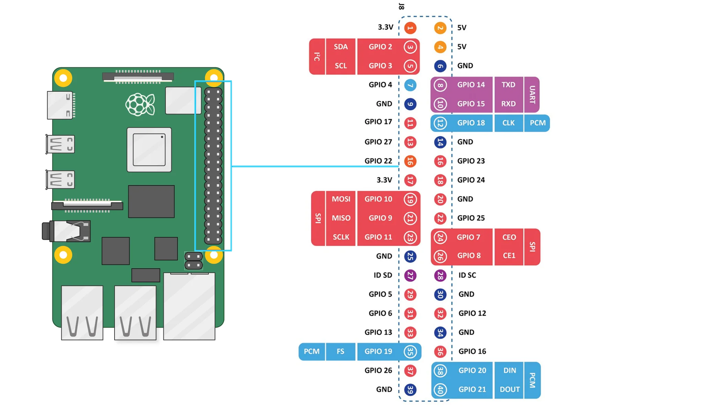

# 树莓派配置

本项目使用树莓派5进行开发与测试。



(from https://vilros.com/pages/raspberry-pi-5-pinout)

## 初始化

```shell
sudo apt update
sudo apt full-upgrade
```

```shell
sudo apt install git
git clone https://github.com/HelloLingC/RaspVisionCar.git
cd RaspVisionCar
pip install -r requirements.txt
```